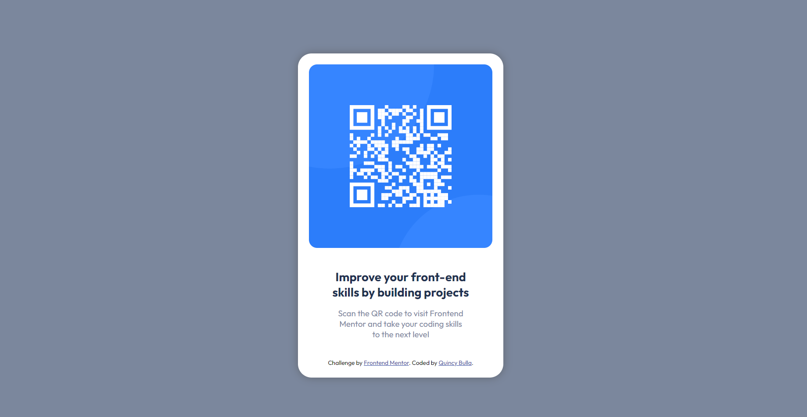

# Frontend Mentor - QR code component solution

This is a solution to the [QR code component challenge on Frontend Mentor](https://www.frontendmentor.io/challenges/qr-code-component-iux_sIO_H). Frontend Mentor challenges help you improve your coding skills by building realistic projects. 

## Table of contents

- [Frontend Mentor - QR code component solution](#frontend-mentor---qr-code-component-solution)
  - [Table of contents](#table-of-contents)
  - [Overview](#overview)
    - [Screenshot](#screenshot)
    - [Links](#links)
  - [My process](#my-process)
    - [Built with](#built-with)
    - [What I learned](#what-i-learned)
    - [Continued development](#continued-development)
    - [Useful resources](#useful-resources)
  - [Author](#author)
  - [Acknowledgments](#acknowledgments)

**Note: Delete this note and update the table of contents based on what sections you keep.**

## Overview
Frontend Mentor QR Code component solution
Overview: The challenge was to build out this responsive QR code component and get it looking as close to the design as possible.
### Screenshot
Screenshots of the finished code results:


### Links

- Solution URL: [Solution URL here](https://github.com/dominionworkz/061123-FrontEndMentor)
- Live Site URL: [Live site URL here](https://061123-front-end-mentor.vercel.app/)

## My process

### Built with
- VSCODE Editor
- Semantic HTML5 markup
- Flexbox
- CSS

### What I learned

A major learning aspect while working through this project. Was literally about the HTML structure and CSS styling, these two I was already working on, and this is why I connected with FrontendMentor in the first place. The code snippets below are what I had to learn on this project.
To see how you can add code snippets, see below:

```html
<!--making sure that the structure is correct was ok, I had trouble with the naming conventions on the index.html at first before I got help. The other thing was link rel="", img src="" because I was using / instead of the ./ so my code was breaking.-->
 <main class="cardContainer">
      <div class="qrContainer">
        
      </div>

      <div class="textContainer">
        <h1>Improve your front-end <br> 
          skills by building projects</h1>

        <p>
          Scan the QR code to visit Frontend <br> 
          Mentor and take your coding skills <br>
          to the next level
        </p>
      </div>

      <div class="attribution">
        Challenge by
        <a href="https://www.frontendmentor.io?ref=challenge" target="_blank"
          >Frontend Mentor</a
        >. Coded by <a href="#">Quincy Bulla</a>.
      </div>
    </main>
```
```css
/*Now, making sure that the styling was correct was some what more of a challenge, I had trouble with selecting the correct properties for each element. I am not sure if it is correct on the body tag especially with the min-height aspect. It seemed to have worked though. I really was working on practicing Googling to assist in finding solutions, before asking for help.

I was also concerned about the order of the properties on the element styling.

*/
*,
* ::before,
* ::after {
  box-sizing: border-box;
}
body {
  display:flex; flex-direction:row; justify-content:center;
  min-height:100vh;
  background-color: hsl(220, 15%, 55%);
  font-family: 'Outfit', sans-serif;
  margin: 0;
  padding: 100px 0 100px}

p {
  color: hsl(220, 15%, 55%);
  font-size: 15px;
}

h1 {
  color: hsl(218, 44%, 22%);
  font-size: 32;
}

.attribution {
  font-size: 11px;
  text-align: center;
}

.attribution a {
  color: hsl(228, 45%, 44%);
}

.cardContainer {
  background-color: hsl(0, 0%, 100%);
  box-shadow: 0 0 1em hsl(215, 7%, 41%);
  border-radius: 25px;
  padding: 20px;
  width: 375px;
}

img {
  border-radius: 15px;
  width:100%;
  height:100%;
  object-fit:cover;
}

.textContainer {
  font-size: 11px;
  text-align: center;
  padding: 20px;
}

/* what I also discovered which was interesting was with the PNG file for the QR Code itself, I thought I had to have it like this for styling the border-radius: .qrContainer {...} I use the browser dev tools through out all and when I used the img tag and applied the border-radius to it that worked. Old code ex: below.*/

/*.qrContainer {
  border: black;
  border-style: solid;
  border-radius: 15px;
  min-height: 130px;
  width: 100%;
}*/
```
### Continued development

What I will continue focusing on in future projects: HTML structure, CSS styling, then JavaScript. Personal goal is to be a FullStack Dev.

### Useful resources
NOTE: these maybe known to other devs already, however, just as I was recommended these, and they have for me helped, I am recommending them as well.

- [Resources 1](https://www.Google.com/) - This helped me for many reason. I really liked that learning and using the skill to Google info and will continue using it going forward. Unless, ChatGPT takes it out, lol.
- [Resources 2](https://www.geeksforgeeks.org/) - This is an amazing site as well to see examples, their SEO comes up in a lots of Google search results.
- [Resources 3](https://dev.to/) - This is another great source where I come to find solution or documentations.
- [Resources 4](https://developer.mozilla.org/en-US/) - This is considered as the standard for learning documentations on web development.

## Author

- Website - [work in progress](https://www.your-site.com)
- Frontend Mentor - [@dominionworkz](https://www.frontendmentor.io/profile/dominionworkz)
- Twitter - [@dominionworkz](https://twitter.com/dominionworkz)

## Acknowledgments

This is where you can give a hat tip to anyone who helped you out on this project. Perhaps you worked in a team or got some inspiration from someone else's solution. This is the perfect place to give them some credit.

